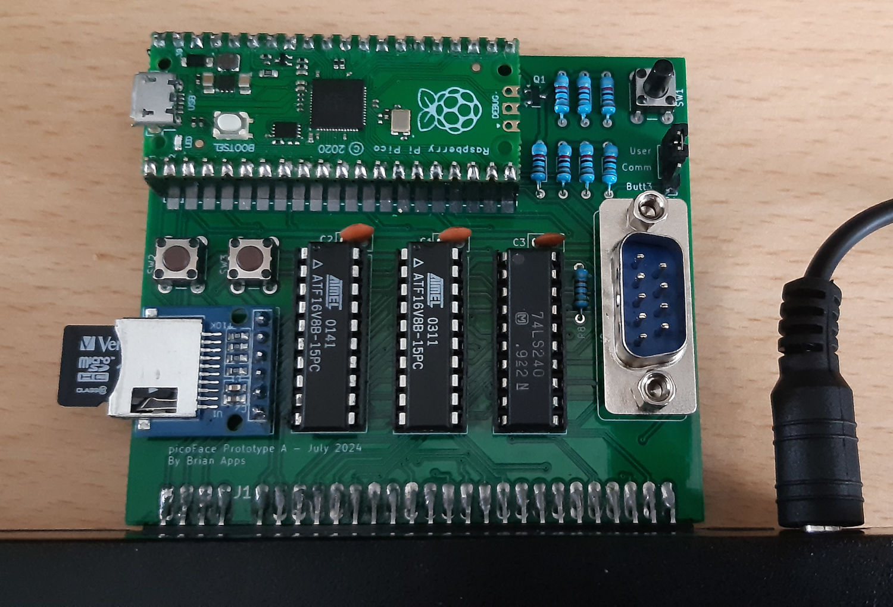

# picoFace KiCad

The picoFace is an inexpensive device for the Sinclair ZX Spectrum that use a Raspberry Pi Pico to provide a Multiface style support. 

See the main picoFace repository for more info https://github.com/brianapps/picoface_poc.

## Info

The circuit board is relatively simple.

The two ATF16V8B chips are programmed with logic provided in the [main picoFace repo](https://github.com/brianapps/picoface_poc).

The design uses a number of custom symbols:
* A modified RPi Pico part without the debug pins on the footprint.
* A custom part for the SD module to match a very cheap and generic one from AliExpress.
* Symbols for the two PLDs. These are updated automatically using a Python script from the [main repo](https://github.com/brianapps/picoface_poc).

## License

picoFace is free software: you can redistribute it and/or modify it under the terms of
the GNU General Public License as published by the Free Software Foundation, either
version 3 of the License, or (at your option) any later version.

picoFace is distributed in the hope that it will be useful, but WITHOUT ANY WARRANTY; 
without even the implied warranty of MERCHANTABILITY or FITNESS FOR A PARTICULAR PURPOSE.
See the GNU General Public License for more details.

A copy of the license is provided in the [LICENSE](./LICENSE) file.
